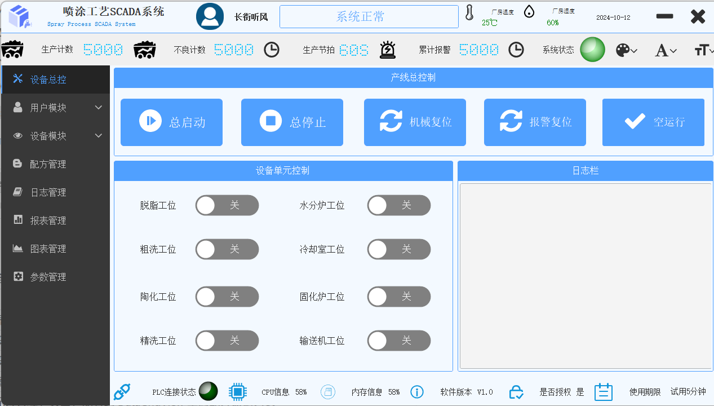
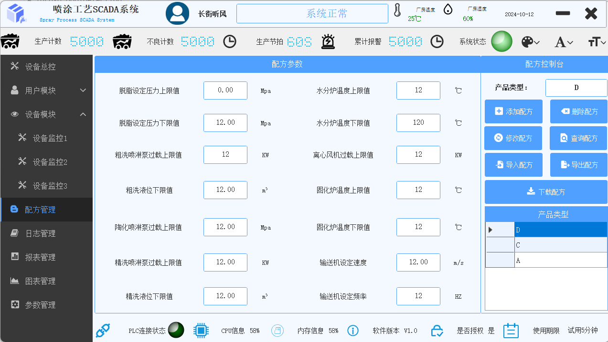
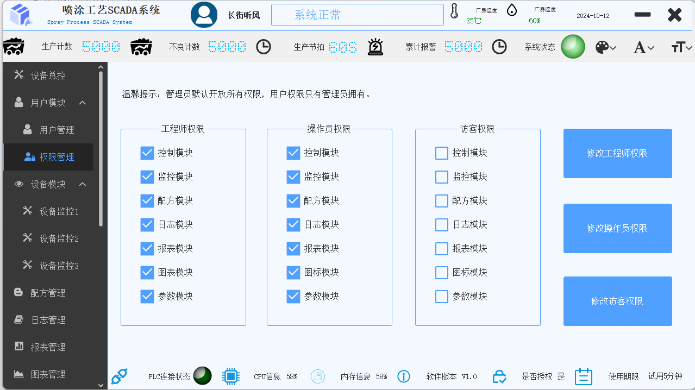
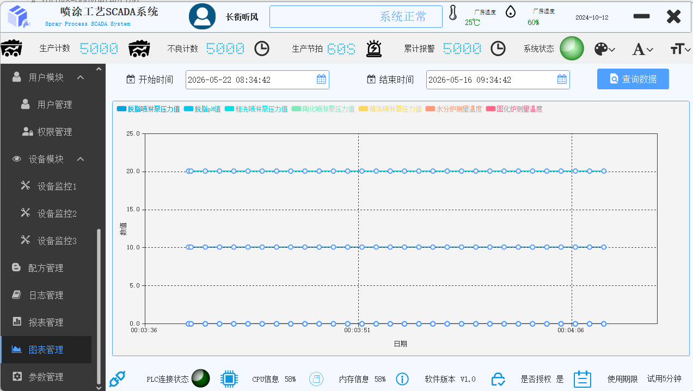
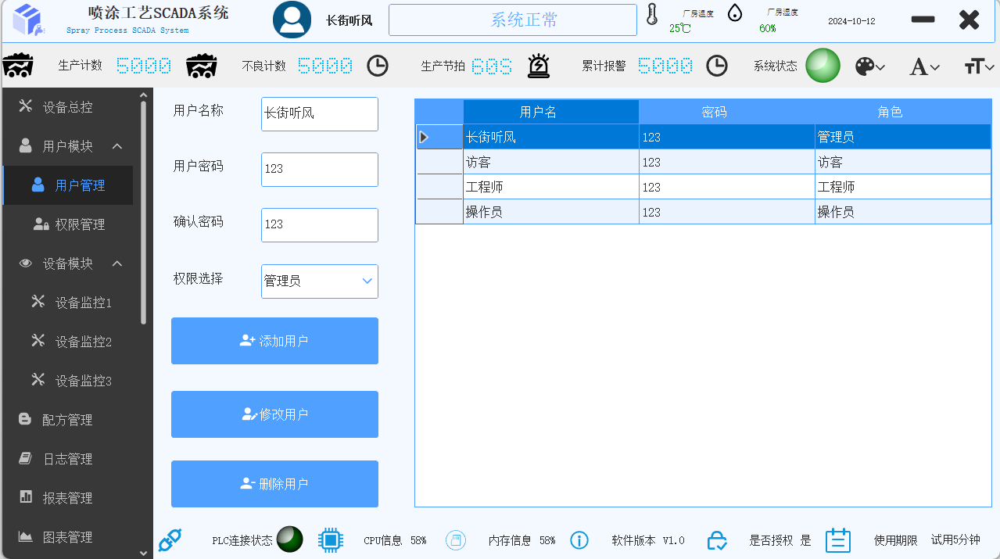
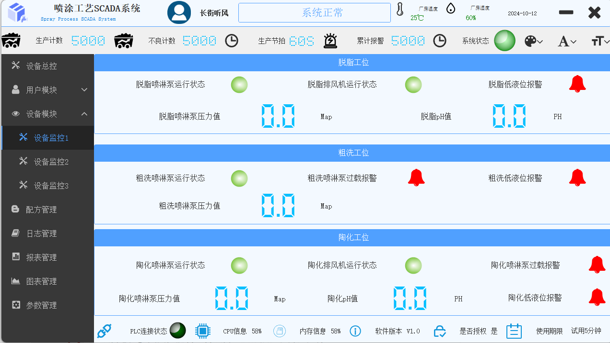
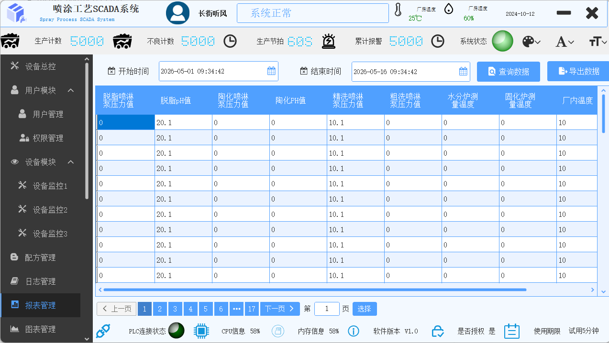
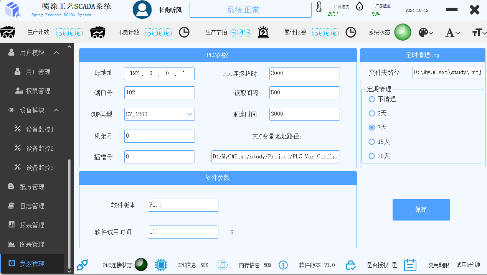

<div align="center">

# SprayingProcessSystem

**喷涂工艺 SCADA 监控系统**

面向喷涂生产线的 WinForms 工业上位机，集成 PLC 实时通信、设备监控与控制、
数据采集可视化、配方管理及权限控制。

[](https://dotnet.microsoft.com/)
[](https://gitee.com/yhuse/SunnyUI)
[](https://github.com/zhaopeiym/IoTClient)
[](LICENSE)

</div>

---

## 系统展示

| 主界面 — 状态栏实时监控 | 设备总控 — 一键启停 |
|:---:|:---:|
|  |  |

| 设备监控 — 工艺段实时数据 | 历史数据图表 — 7 条曲线 |
|:---:|:---:|
|  |  |

| 用户管理 — 账户增删改查 | 权限管理 — 角色访问控制 |
|:---:|:---:|
|  |  |

<details>
<summary>更多截图</summary>

| 数据报表 — 分页查询 | 系统参数配置 |
|:---:|:---:|
|  |  |

</details>

> **注意**：截图中展示的所有数据均为编造的测试数据，并非真实采集，仅供演示界面功能。

---

## 核心功能

### PLC 实时通信

基于 IoTClient 实现西门子 S7-1200/1500 PLC 通信。采用**三字典架构**（ReadDic / WriteDic / DataDic）分离变量读写与显示职责，后台线程循环 `BatchRead` 批量读取全部变量，读取失败自动断线重连。连接参数（IP、端口、CPU 类型、机架/插槽、超时时间、读取间隔等）通过 `config.ini` 配置，PLC 变量映射表通过 Excel 管理，运行时 MiniExcel 动态加载。

### 设备监控与控制

覆盖喷涂生产线 **8 个工艺段**（脱脂 → 粗洗 → 陶化 → 精洗 → 水分炉 → 固化炉 → 冷却 → 输送系统），每段通过自定义控件组合实现状态指示、数值显示、报警、开关控制和参数输入。控件暴露设计时属性（`VariableName`），拖入窗体配置变量名即可自动绑定 PLC 数据，500ms 定时刷新。

### 数据采集与可视化

1 秒定时器将传感器数据（压力、pH、温度、湿度）持久化到 SQLite。历史图表以 7 条平滑折线展示工艺参数趋势，支持时间范围查询；数据报表支持分页浏览与 Excel 导出。

### 配方管理

产品配方 CRUD，涵盖 8 个工艺段的压力/温度/液位/速度/频率等参数。支持 Excel 批量导入（按产品类型匹配，存在则更新，不存在则新增），以及一键将配方参数以 Float 类型下发到 PLC。

### 用户与权限管理

4 级角色（管理员 / 工程师 / 操作员 / 访客），7 个功能模块独立授权。管理员拥有全部权限，其余角色通过权限管理页面自定义配置，导航节点点击时动态校验权限。

### 日志管理

NLog 按日期 + 级别自动归档，三级联动浏览（日期 → 级别 → 文件），日志内容可解析为结构化表格，支持 TXT / Excel 导出。

---

## 技术架构

```
┌───────────────────────────────────────────────────────┐
│  FrmMain — Header（主题/字体/字号）+ Aside（11页导航）  │
│             + Footer（PLC状态灯 + 产量/温度/报警）      │
├───────────────────────────────────────────────────────┤
│  Globals（三字典 + PLC 通信）                          │
│  ReadDic ──→ BatchRead ──→ DataDic ──→ 自定义控件      │
│  控件事件 ──→ WriteDic ──→ PlcWrite ──→ PLC            │
├───────────────────────────────────────────────────────┤
│  BLL（Manager）──→ DAL（Service + SqlSugar）──→ Model  │
├───────────────────────────────────────────────────────┤
│  SQLite + NLog + config.ini + appsettings.json         │
└───────────────────────────────────────────────────────┘
```

| 设计决策 | 实现方式 |
|---------|---------|
| 三字典分离 | ReadDic / WriteDic / DataDic 全局单例，控件只关心 VariableName |
| 批量读取 + 断线重连 | BatchRead 一次读取全部变量，失败自动 Close → 循环 Open |
| 三层 + 自动 DI | 程序集扫描注册，换数据库只改 DAL |
| 6 个自定义控件 | 暴露 `[Browsable]` 设计时属性，配置变量名即绑定 |
| 防闪烁 | 全部窗体重写 CreateParams，WS_EX_COMPOSITED 双缓冲 |

---

## 技术栈

| 分类 | 技术 |
|------|------|
| 框架 | .NET 10.0 (Windows) |
| UI | WinForms + SunnyUI 3.7.2 |
| PLC 通信 | IoTClient（西门子 S7 协议） |
| ORM | SqlSugar Core（SQLite，CodeFirst 自动建表） |
| Excel | MiniExcel |
| 依赖注入 | Microsoft.Extensions.DependencyInjection + HZY.Framework 自动扫描 |
| 对象映射 | Mapster |
| 日志 | NLog |
| 配置 | INI（PLC 参数）+ JSON（数据库/日志） |

---

## 快速开始

### 环境要求

- Visual Studio 2022 v17.12+
- .NET 10.0 SDK
- 西门子 S7 系列 PLC（或 PLCSIM Advanced 模拟器）

### 运行步骤

```bash
git clone https://github.com/NothingLikeYouthRoam/SprayingProcessSystem.git
# 用 Visual Studio 打开 .slnx，还原 NuGet 包，编译运行
```

### 首次配置

1. 「参数管理」页面配置 PLC 连接参数和变量表 Excel 路径
2. SQLite 数据库自动创建，需手动插入管理员账户：

```sql
INSERT INTO [user] (UserName, UserPassword, Role) VALUES ('admin', 'admin', '管理员');
```

---

## 项目结构

```
SprayingProcessSystem/
├── SprayingProcessSystem/          # UI 层
│   ├── Program.cs                  # DI 容器 + SqlSugar + NLog 注册
│   ├── Globals.cs                  # 三字典 + PLC 通信 + PlcWrite
│   ├── FrmMain.cs                  # 主窗体（导航 + 状态栏 + 读取循环）
│   ├── Pages/                      # 11 个功能页面
│   ├── User*.cs                    # 6 个自定义控件
│   └── FrmLogin.cs / FromStartLoad.cs
├── System.BLL/                     # 业务逻辑层（4 个 Manager + DTO）
├── System.DAL/                     # 数据访问层（泛型基类 + 4 个 Service）
├── System.Model/                   # 实体模型（User / Auth / Data / Recipe）
└── System.Helper/                  # 工具（BaseResult / Enums / RuntimeStatus）
```

---

## License

MIT License
